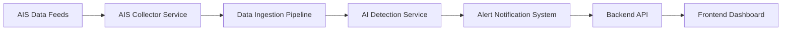

# Finshield

Finshield is a pioneering startup dedicated to protecting marine ecosystems by leveraging Automatic Identification System (AIS) maritime data and an AI-powered detection algorithm to identify and tag vessels involved in illegal shark finning activities.

## 🚀 Features

* **Real-time AIS Ingestion**: Stream live AIS signals to monitor vessel movements worldwide.
* **AIS Parsing & Tracking**: Decode AIS messages to extract vessel metadata and geolocation in real-time.
* **AI-Powered Finning Detection**: Utilize deep learning models to analyze vessel behavior patterns indicative of shark finning.
* **Suspicious Vessel Tagging**: Automatically flag and tag vessels exhibiting high-risk finning behavior.
* **Interactive Monitoring Dashboard**: Web-based interface for visualizing vessel tracks, alerts, and historical data.

## 🏗️ Architecture Overview



1. **AIS Collector Service**: Access to satellite and terrestrial AIS feeds.
2. **Data Ingestion Pipeline**: Processes raw AIS messages.
3. **AI Detection Service**: Python-based computer vision algorithm running vessel behavior models.
4. **Alert System**: Triggers notifications for high-confidence finning detections.
5. **Backend API**: Exposes endpoints for data retrieval and alert management (FastAPI).
6. **Frontend Dashboard**: React app with Tailwind CSS and shadcn/ui for interactive visualizations.

## ⚙️ Installation & Setup

1. **Clone the repository**:

   ```bash
   git clone https://github.com/AyanAmjad20/finshield.git
   cd finshield
   ```

2. **Set up Python environment**:

   ```bash
   python3 -m venv venv
   source venv/bin/activate
   ```

3. **Build and run the frontend backup**:

   ```bash
   cd finshield-sight-watch-backup
   npm install
   npm run build
   npm run dev
   ```

## 📊 Data Sources

* **AIS Feeds**: Global feeds via satellite (Spire, ORBCOMM) and coastal terrestrial stations.
* **Vessel Registry**: Public maritime databases for vessel metadata enrichment.

## 🤖 AI Detection Algorithm

The finning detection model is a custom deep learning pipeline that ingests vessel speed, course changes, and positional clustering to detect patterns consistent with finning operations. It is trained on labeled AIS segments and validated with historical enforcement data. Key components:

* Preprocessing: Segment AIS tracks into fixed-length time windows.
* Feature Extraction: Compute speed variance, course deviation, stop durations.
* Model: YOLO/OpenCV
* Thresholding: Alerts triggered when model confidence exceeds the configured threshold.

## 🤝 Contributing

We welcome contributions! Please adhere to our [Code of Conduct](CODE_OF_CONDUCT.md) and follow these steps:

1. Fork the repository.
2. Create a feature branch (`git checkout -b feature/new-feature`).
3. Commit your changes (`git commit -m 'Add new feature'`).
4. Push to branch (`git push origin feature/new-feature`).
5. Open a Pull Request detailing your changes.
